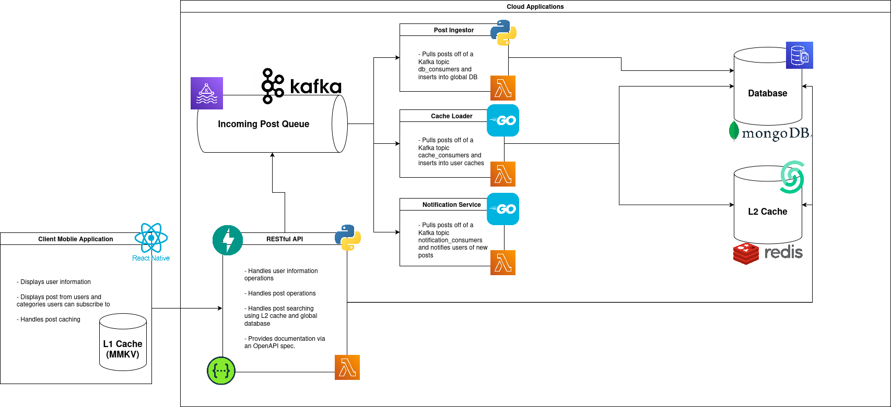

# Event Posting App (EPA)

[](https://github.com/NateMartes/epa/commits)

[](#)
[](#)
[](#)
[](#)
[](#)
[](#)

Safety is important and as technology gets more sophisticated, so should our ability to stay safe. Our project EPA, the Event Posting App, will be a mobile application that allows users to post about safety concerns in local areas to ensure that users know what is going on in their community. Users can subscribe to categories and specific tags within those categories and be notified as soon as an event occurs.

## System Architecture

The overview of EPA can appear as such:



### System Architecture Choices

Some chocies we want to highlight are the following:
- **Contract First API**: The main EPA API uses a Contract First approach, so that we can always serve a client apporiately.
- **Cache Aside Pattern**: The application focuses on a Cache Aside Pattern, meaning we cache posts for users for that access is faster. We include 2 caching layers, a client side and a server side.

## Quick Start
If you have Docker installed, then you can use the `docker compose` plugin for starting services:
```bash
docker compose up
```

Some microservices (like the cache_loader, notify_service) operate using AWS Serverless Application Model (see below)

## The API

The EPA API uses a Contract-First approach, meaning endpoints are auto generated from an OpenAPI spec using the `openapi-generator-cli` tool:

Installing the tool uses `npm`:
```bash
npm install -g @openapitools/openapi-generator-cli
```

Then you can generate the API endpoints like such:
```bash
openapi-generator-cli generate \
-i openapi.yaml \
-g python-fastapi \
-o . \ --additional-properties=packageName=epa_api,fastapiImplementationPackage=api_implementation
```

The service methods (the actual logic of the API) is stored within the `./api/src/epa_api/api_implementation` directory.

### Adding Endpoints
When adding endpoints, update the `openapi.yml` file with the new endpoint information and run the previous command. Then add the new method to the `./api/src/epa_api/api_implementation/` directory. The function that the API will call **MUST** be defined by the `operationId`

Example:
```yaml
paths:
  /status:
    get:
      operationId: get_status # HERE: function should be called `get_status`
      responses:
        "200":
          content:
            application/json:
              schema:
                $ref: "#/components/schemas/Status"
          description: API is healthy
      summary: Check API health
```

Then you can add the code in the `./api/src/epa_api/api_implementation/` directory:
```python
from epa_api.apis.default_api_base import BaseDefaultApi
from epa_api.models.status import Status

class EpaAPIImplementation(BaseDefaultApi):
    async def get_status(self) -> Status:
        return Status(status="healthy", version="1.0.0")
```

## The Database
The database uses MongoDB for storing information such as `users`, `posts`, `session_tokens`, `categories`, and more.
The database is initialized using a Python script and the `config.json` file found within the `./database` directory.
The database `docker-compose.yml` file includes a database initializer to add the defined collections.
The default database is called `epa_database`. This cannot be configured

### Configuration Syntax

The configuration file uses JSON format syntax to define needed database collections.
Some fields can be included to add indexes to MongoDB collections:
```json
{
  "collections": [
    {
      "name": "users",
      "indexes": [
        {"field": "user_id", "unique": true},
        {"field": "google_id", "unique": true}
      ]
    },
    {
      "name": "session_tokens",
      "indexes": [
        {"field": "session_token", "expireAfterSeconds": 604800},
      ]
    },
  ]
```

- The `unqiue` field says that in this collection index, this field will always be unqiue.
- The `expireAfterSeconds` field sats that in this collection index, this field will expire in some amount of time in seconds.

## User Timeline Caching
To ensure a user can see a post very quickly, we preform caching on post and store them into a Redis database.
The provider for this service is Upstash. You can locally test this database using the `docker-compose.yml` file in the
`./user_timeline_post_cache` directory to simulate Upstash.

### Connecting to the Cahce
In both cases, local or production, you can use a redis client to connect to the redis database.
Example in Go:
```go

```

---
## The Post Queue

---
## The Notifier

---
## The Post Ingestor

___
## The User Cache Loader

---
## The EPA Moblie App

---
## Useful Commands

Set environment variables from `.env`:
```bash
export $(grep -v '^#' .env | xargs)
```

Unset environment variables from `.env`:
```bash
unset $(grep -v '^#' .env | sed -E 's/(.*)=.*/\1/' | xargs)
```
